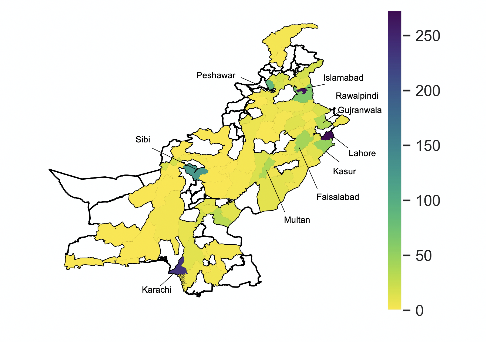
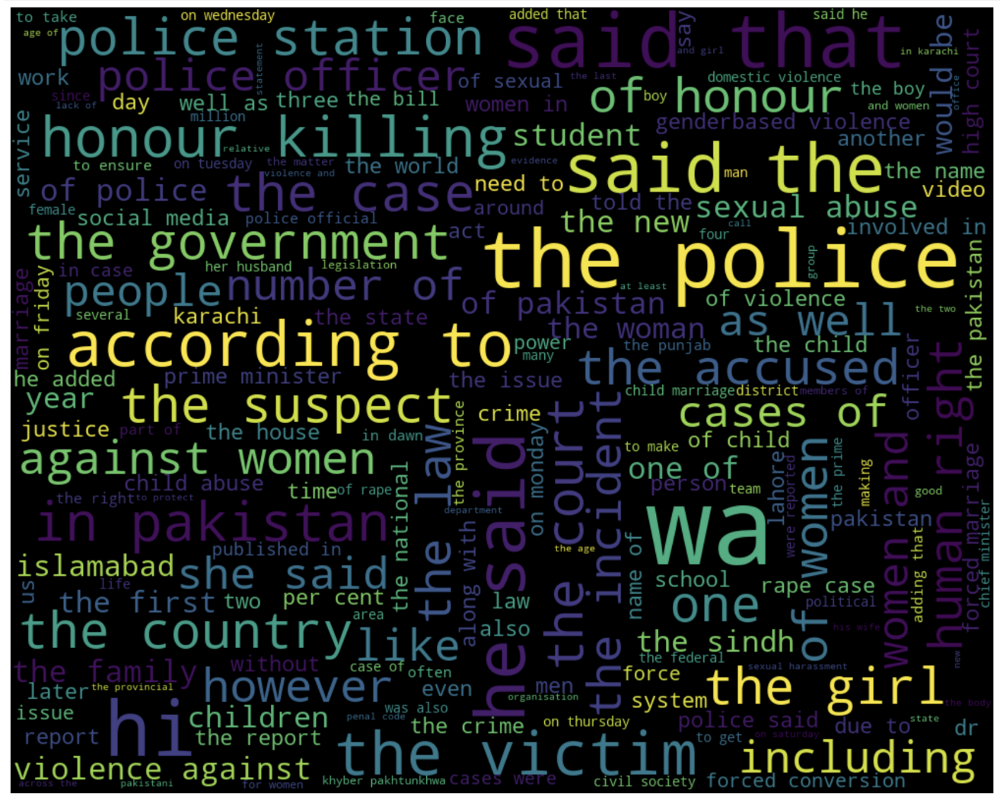

# Extracting newspaper articles related to Gender Based Violence in Pakistan

### Folder Key:

- extracted_information.csv: CSV containing link, text and additional information that was extracted from links that were collected
- drf_data.csv: CSV containing link, text and additional information that was extracted from links DRF provided
- plot1_updated.png: Cities mentioned in extracted articles (includes drf data as well) at least once 
- map_labelled_manually.png: Mapped articles
- wordcloud.png: wordcloud based on extracted text from articles
- lda2.html: "Topics" being mentioned in extracted newspaper articles' text (this was created using Topic Modelling in Python). Results are visualized [here](https://rukhshanarifm.github.io/) -- this is created using Python's ```sklearn``` library.

## Methodology (to create extracted_information.csv):

- Shortlisted 2 newspapers (Dawn and The News)
- Searching keywords on each newspaper's website
- Going back 10 pages in search results
- Extracting each link from each page
- Once links are collected, extract newspaper information from each link. This includes variables such as: article text, article title, datetime (this is not available for The News). This information was also collected from links shared by DRF.

## Limitations:

- Information from Dawn's Herald articles were not extracted
- Since we search on keywords, there are articles that are not related to GBV -- these are very few in number. This would require manually checking that I was unable to do during my academic term.
- The total number of articles that were extracted were ~1200. This does not account for all articles published on a newspaper's website. It could be that cases are underreported but there is no supporting argument based on this project. This would require further work that includes a combination of qualitative and quantitative research/analysis.

## Visualizations:

Cities mentioned in extracted articles' text:



Keywords in extracted articles' text:



Visualizing topics in extracted articles' text: This can be viewed [here](https://rukhshanarifm.github.io/).

